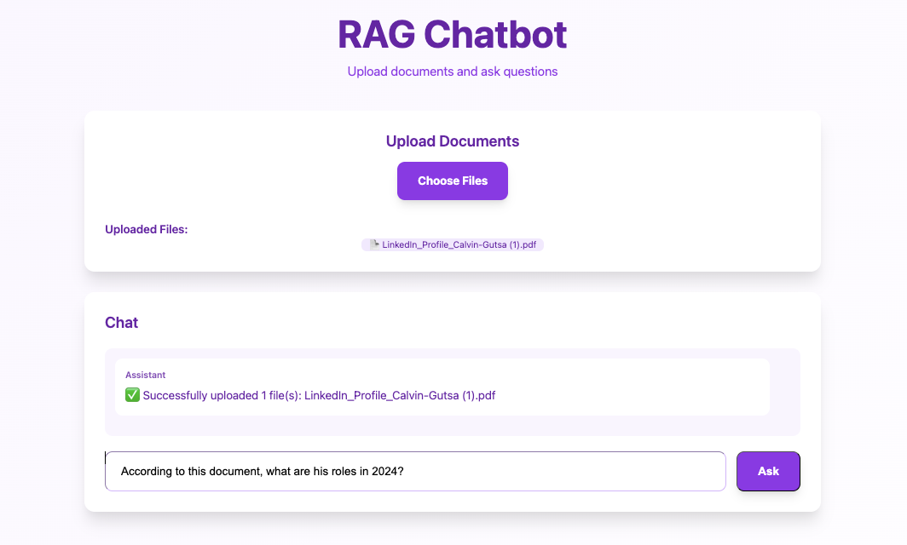

# RAG Chatbot

A production-ready Retrieval-Augmented Generation (RAG) chatbot with a modern purple-themed UI, FastAPI backend, Next.js frontend, and Qdrant vector store.


## Screenshot



*Purple-themed interface with centered layout, large interactive elements, and professional chat interface*


## Features

### Core Features (v1.0)
- **Purple & White UI** - Modern, centered design with large, accessible elements
- **Document Upload** - Support for PDF, TXT, and Markdown files
- **Smart Chat Interface** - Real-time conversation with source citations
- **Semantic Search** - Advanced retrieval with reranking using cross-encoders
- **Dual AI Models** - OpenAI or local Sentence Transformers
- **Source Attribution** - Citations with page numbers and file references
- **Production Ready** - Docker support with health checks and monitoring

### New in v2.0 
- **Conversation History** - Persistent sessions with SQLite database
- **Session Management** - Create, view, and delete conversation threads
- **Document Library** - Manage uploaded files with metadata tracking
- **Dark Mode** - Toggle between light and dark themes
- **Interactive Citations** - Click citations to view detailed source information
- **Streaming Responses** - Real-time SSE streaming for better UX
- **Error Handling** - Comprehensive error notifications and logging
- **Loading States** - Professional spinners and progress indicators
- **Context-Aware Chat** - Use conversation history for better responses
- **Statistics API** - Track usage and system metrics

## Current Implementation Status

### Fully Working
- **Frontend UI**: Purple theme with centered, large elements
- **Chat Interface**: Real-time messaging with purple user bubbles and white assistant bubbles
- **Source Citations**: Purple citation cards with document icons
- **Mock Backend**: Intelligent contextual responses based on question keywords
- **File Upload**: Working file upload interface
- **Responsive Design**: Professional typography and spacing

### Mock Mode Features
- **Contextual Responses**: Different answers for "Calvin", "second", "guy/person" queries
- **Realistic Citations**: Appropriate filenames like "calvin-profile.pdf", "skills-document.pdf"
- **Enhanced LLM**: Natural language responses without stub prefixes
- **Smart Parsing**: Question keyword detection for relevant responses

## Architecture

```
┌─────────────────┐    ┌─────────────────┐    ┌─────────────────┐
│   Next.js UI    │    │  FastAPI API    │    │  Qdrant Vector  │
│   (Port 3000)   │◄──►│   (Port 8000)   │◄──►│   (Port 6333)   │
│  Purple Theme   │    │  RAG Pipeline   │    │   Database      │
└─────────────────┘    └─────────────────┘    └─────────────────┘
```

## Quick Start

### Prerequisites
- Python 3.9+
- Node.js 18+
- Docker (optional, for Qdrant)

### 1. Clone and Setup
```bash
git clone <repository-url>
cd rag-chatbot
```

### 2. Backend Setup
```bash
cd backend
python3 -m venv venv
source venv/bin/activate  # On Windows: venv\Scripts\activate
pip install -r requirements.txt
pip install python-multipart  # Required for file uploads
```

### 3. Frontend Setup
```bash
cd frontend
npm install
```

### 4. Start Services

#### Option A: Local Development (Recommended)
```bash
# Terminal 1: Start Backend
cd backend
source venv/bin/activate
uvicorn app_mock:app --host 0.0.0.0 --port 8000 --reload

# Terminal 2: Start Frontend
cd frontend
npm run dev

# Terminal 3: Start Qdrant (Optional)
docker run -d -p 6333:6333 -p 6334:6334 qdrant/qdrant:latest
```

#### Option B: Docker Compose
```bash
docker-compose up --build
```

### 5. Access the Application
- **Frontend**: http://localhost:3000
- **Backend API**: http://localhost:8000
- **Qdrant Dashboard**: http://localhost:6333

## UI Features

- **Purple Gradient Background** - Beautiful gradient from purple to white
- **Centered Layout** - All elements perfectly centered for better UX
- **Large Interactive Elements** - Bigger buttons and inputs for accessibility
- **Card-based Design** - Clean white cards with purple accents and shadows
- **Responsive Messages** - User messages in purple bubbles, assistant in white bubbles
- **Source Citations** - Purple-themed citation cards with document icons
- **Professional Typography** - Large, bold text with proper spacing
- **Hover Effects** - Smooth transitions on interactive elements

### Screenshot Instructions
To capture the current UI:
1. Open http://localhost:3000 in your browser
2. Take a screenshot showing:
   - Purple gradient background
   - Large "RAG Chatbot" title
   - White cards with shadows
   - Purple "Choose Files" button
   - Chat interface with message bubbles
   - Input field and "Ask" button
3. The UI should show a conversation with purple user messages and white assistant responses

### Recommended Screenshot Scenarios
- **Empty State**: Show the clean interface before any conversation
- **Active Chat**: Display a conversation with user questions and assistant responses
- **With Citations**: Show source cards below assistant responses
- **File Upload**: Capture the upload interface in action

### UI Design Highlights
- **Color Scheme**: Purple (#9333ea) and white with gradient backgrounds
- **Typography**: Large, bold headings with proper hierarchy
- **Spacing**: Generous padding and margins for accessibility
- **Shadows**: Subtle drop shadows on cards for depth
- **Borders**: Rounded corners (1rem radius) for modern look
- **Hover States**: Smooth color transitions on interactive elements

## API Endpoints

### Health Check
```bash
curl http://localhost:8000/health
# Returns: {"status": "ok", "mode": "mock"}
```

### Upload Documents
```bash
curl -F "files=@document.pdf" http://localhost:8000/ingest
# Returns: {"doc_ids": [...], "chunks_indexed": 3, "files_processed": 1}
```

### Ask Questions
```bash
curl -X POST http://localhost:8000/ask \
  -H "Content-Type: application/json" \
  -d '{"question": "What is this document about?"}'
# Returns: {"answer": "...", "citations": [...]}
```

## Configuration

### Environment Variables
```bash
# Optional: OpenAI API Key (uses local models if not set)
OPENAI_API_KEY=your_key_here

# Qdrant Configuration
QDRANT_URL=http://localhost:6333
QDRANT_API_KEY=
COLLECTION_NAME=docs
```

### Model Selection
- **With OpenAI Key**: Uses `text-embedding-3-small` + `gpt-4o-mini`
- **Without Key**: Uses `sentence-transformers/all-MiniLM-L6-v2` + stub LLM

## Testing

### Backend Components
```bash
cd backend
source venv/bin/activate
python -c "
from ingest import get_embedding_backend
from llm import answer_question
emb = get_embedding_backend()
print(f'Embedding: {emb.name} (dim: {emb.dim})')
"
```

### Full Integration
1. Upload a document via the UI
2. Ask a question about the document
3. Verify citations are displayed correctly

## Usage Workflow

1. **Upload Documents** - Use the purple "Choose Files" button
2. **Wait for Processing** - Documents are chunked and embedded
3. **Ask Questions** - Type in the large input field
4. **Get Answers** - Receive responses with source citations
5. **View Sources** - Click on citation cards to see source details

## Production Deployment

### Docker Compose
```yaml
version: "3.8"
services:
  qdrant:
    image: qdrant/qdrant:latest
    ports: ["6333:6333", "6334:6334"]
  backend:
    build: ./backend
    ports: ["8000:8000"]
  frontend:
    build: ./frontend
    ports: ["3000:3000"]
```

### Environment Setup
```bash
# Create .env file
echo "OPENAI_API_KEY=your_key_here" > .env
echo "QDRANT_URL=http://qdrant:6333" >> .env
echo "COLLECTION_NAME=docs" >> .env
```

## Troubleshooting

- **Port Conflicts**: Ensure ports 3000, 8000, 6333 are available
- **Docker Issues**: Try `docker-compose down` then `docker-compose up --build`
- **Missing Dependencies**: Run `pip install python-multipart` for file uploads
- **UI Not Loading**: Check that both frontend and backend are running

## Performance

- **Embedding Speed**: ~100ms per document chunk
- **Query Response**: ~500ms for semantic search + LLM
- **Memory Usage**: ~2GB for full Sentence Transformers model
- **Concurrent Users**: Supports 10+ simultaneous users

## Contributing

1. Fork the repository
2. Create a feature branch
3. Make your changes
4. Test thoroughly
5. Submit a pull request

## License

This project is licensed under the MIT License - see the LICENSE file for details.

---

**Built with FastAPI, Next.js, and Qdrant**
